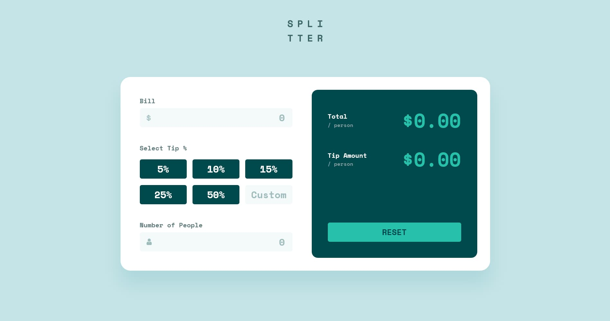

# Frontend Mentor - Tip calculator app solution

This is a solution to the [Tip calculator app challenge on Frontend Mentor](https://www.frontendmentor.io/challenges/tip-calculator-app-ugJNGbJUX). Frontend Mentor challenges help you improve your coding skills by building realistic projects.

## Table of contents

- [Overview](#overview)
    - [The challenge](#the-challenge)
    - [Screenshot](#screenshot)
    - [Links](#links)
- [My process](#my-process)
    - [Built with](#built-with)
    - [Useful resources](#useful-resources)
- [Author](#author)

## Overview

### The challenge

Users should be able to:

- View the optimal layout for the app depending on their device's screen size
- See hover states for all interactive elements on the page
- Calculate the correct tip and total cost of the bill per person

### Screenshot

### Links

- Solution URL: [https://github.com/K-Real-Mh/tip-calculator-app-main](https://github.com/K-Real-Mh/tip-calculator-app-main)
- Live Site URL: [https://celebrated-gnome-e091a3.netlify.app/](https://celebrated-gnome-e091a3.netlify.app/)

## My process

### Built with

- Semantic HTML5 markup
- CSS custom properties
- Flexbox
- CSS Grid
- Mobile-first workflow
- [React](https://react.dev/) - JS library

### Useful resources

- [Patterns](https://www.patterns.dev/) - This helped me for choose provider design pattern for working with state. I really liked this pattern and will use it going forward.
- [Doka](https://doka.guide/) - This is a great site with documentation, it helped me solve my issues with css.

## Author

- Linkedin - [Cyril Makhov](https://www.linkedin.com/in/cyril-makhov/)
- GitHub - [K-Real-Mh](https://github.com/K-Real-Mh)
